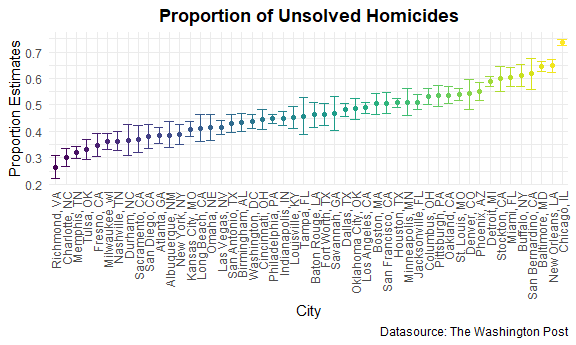
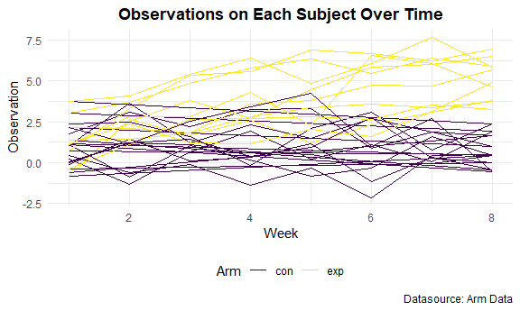

P8105 Homework 5
================
Kyung Suk Lee
2020-11-11

  - [Problem 1](#problem-1)
      - [1-1) Description of the raw data](#description-of-the-raw-data)
      - [1-2) The number of homicides and unsolved
        homicides](#the-number-of-homicides-and-unsolved-homicides)
      - [1-3) Proportion of unsolved homicides
        (Baltimore)](#proportion-of-unsolved-homicides-baltimore)
      - [1-4) Proportion of unsolved homicides (All
        cities)](#proportion-of-unsolved-homicides-all-cities)
      - [1-5) Plot](#plot)
  - [Problem 2](#problem-2)
      - [2-1) Create a tidy dataframe](#create-a-tidy-dataframe)
      - [2-1) Make a spaghetti plot](#make-a-spaghetti-plot)
  - [Problem 3](#problem-3)
      - [3-1) T-test function (set n = 30, sigma =
        5)](#t-test-function-set-n-30-sigma-5)
      - [3-2) Set mu = 0 and generate 5000
        datasets](#set-mu-0-and-generate-5000-datasets)
      - [3-3) Repeat mu = 1 to 6](#repeat-mu-1-to-6)

``` r
library(tidyverse)
library(rvest)

knitr::opts_chunk$set(
  fig.width = 6,
  fig.asp = .6,
  out.width = "90%")

theme_set(theme_minimal() + theme(legend.position = "bottom"))
options(
  ggplot2.continuous.colour = "viridis",
  ggplot2.continuous.fill = "viridis")

scale_colour_discrete = scale_color_viridis_d
scale_fill_discrete = scale_fill_viridis_d

knitr::opts_chunk$set(comment = NA, message = FALSE, warning = FALSE, echo = TRUE)
```

# Problem 1

## 1-1) Description of the raw data

``` r
homicide_raw =
  read_csv("homicide_data/homicide-data.csv")
homicide_raw
```

    # A tibble: 52,179 x 12
       uid   reported_date victim_last victim_first victim_race victim_age
       <chr>         <dbl> <chr>       <chr>        <chr>       <chr>     
     1 Alb-~      20100504 GARCIA      JUAN         Hispanic    78        
     2 Alb-~      20100216 MONTOYA     CAMERON      Hispanic    17        
     3 Alb-~      20100601 SATTERFIELD VIVIANA      White       15        
     4 Alb-~      20100101 MENDIOLA    CARLOS       Hispanic    32        
     5 Alb-~      20100102 MULA        VIVIAN       White       72        
     6 Alb-~      20100126 BOOK        GERALDINE    White       91        
     7 Alb-~      20100127 MALDONADO   DAVID        Hispanic    52        
     8 Alb-~      20100127 MALDONADO   CONNIE       Hispanic    52        
     9 Alb-~      20100130 MARTIN-LEY~ GUSTAVO      White       56        
    10 Alb-~      20100210 HERRERA     ISRAEL       Hispanic    43        
    # ... with 52,169 more rows, and 6 more variables: victim_sex <chr>,
    #   city <chr>, state <chr>, lat <dbl>, lon <dbl>, disposition <chr>

  - **Some comments on raw data**: This dataset is collected by The
    Washington Post by gathering data on more than 52,000 criminal
    homicides over the past decade in 50 of the largest American cities.
    The dataset is comprised of **52179** observations (rows) and **12**
    columns. The variables include *uid, reported\_date, victim\_last,
    victim\_first, victim\_race, victim\_age, victim\_sex, city, state,
    lat, lon, disposition*. Some of the important variables in this
    dataset are location of the killing, whether an arrest was made and,
    basic demographic information (e.g., sex, age, race) about each
    victim.

## 1-2) The number of homicides and unsolved homicides

``` r
# create a city_state variable
# obtain the total number of homicides and the number of unsolved homicides
homicide_df = 
  homicide_raw %>% 
  janitor::clean_names() %>% 
  mutate(
    city_state = str_c(city, state, sep = ", "),
    resolved = case_when(
      disposition == "Closed without arrest" ~ "unsolved",
      disposition == "Open/No arrest"        ~ "unsolved",
      disposition == "Closed by arrest"      ~ "solved"
    )
  ) %>% 
  select(city_state, resolved) %>% 
  filter(city_state != "Tulsa, AL")

aggregate_df = 
  homicide_df %>% 
    group_by(city_state) %>% 
    summarize(
      hom_total = n(),
      hom_unsolved = sum(resolved == "unsolved")
      )

aggregate_df
```

    # A tibble: 50 x 3
       city_state      hom_total hom_unsolved
       <chr>               <int>        <int>
     1 Albuquerque, NM       378          146
     2 Atlanta, GA           973          373
     3 Baltimore, MD        2827         1825
     4 Baton Rouge, LA       424          196
     5 Birmingham, AL        800          347
     6 Boston, MA            614          310
     7 Buffalo, NY           521          319
     8 Charlotte, NC         687          206
     9 Chicago, IL          5535         4073
    10 Cincinnati, OH        694          309
    # ... with 40 more rows

## 1-3) Proportion of unsolved homicides (Baltimore)

``` r
# pull the estimated proportion and confidence intervals

prop.test(
  aggregate_df %>% filter(city_state == "Baltimore, MD") %>% pull(hom_unsolved),
  aggregate_df %>% filter(city_state == "Baltimore, MD") %>% pull(hom_total)
  ) %>% 
  broom::tidy() %>% 
  select(estimate, conf.low, conf.high)
```

    # A tibble: 1 x 3
      estimate conf.low conf.high
         <dbl>    <dbl>     <dbl>
    1    0.646    0.628     0.663

## 1-4) Proportion of unsolved homicides (All cities)

``` r
# extract the proportion of unsolved homicides for each cities
# extract the confidence interval for each cities
results_df = 
  aggregate_df %>% 
    mutate(
      prop_tests = map2(.x = hom_unsolved, .y = hom_total, ~prop.test(x = .x, n = .y)),
      tidy_tests = map(.x = prop_tests, ~broom::tidy(.x))
    ) %>% 
    select(-prop_tests) %>% 
    unnest(tidy_tests) %>% 
    select(city_state, estimate, conf.low, conf.high)

results_df
```

    # A tibble: 50 x 4
       city_state      estimate conf.low conf.high
       <chr>              <dbl>    <dbl>     <dbl>
     1 Albuquerque, NM    0.386    0.337     0.438
     2 Atlanta, GA        0.383    0.353     0.415
     3 Baltimore, MD      0.646    0.628     0.663
     4 Baton Rouge, LA    0.462    0.414     0.511
     5 Birmingham, AL     0.434    0.399     0.469
     6 Boston, MA         0.505    0.465     0.545
     7 Buffalo, NY        0.612    0.569     0.654
     8 Charlotte, NC      0.300    0.266     0.336
     9 Chicago, IL        0.736    0.724     0.747
    10 Cincinnati, OH     0.445    0.408     0.483
    # ... with 40 more rows

## 1-5) Plot

``` r
results_df %>%
  mutate(city_state = fct_reorder(city_state, estimate)) %>% 
  ggplot(aes(x = city_state, y = estimate, color = city_state)) +
  geom_point() +
  geom_errorbar(aes(ymin = conf.low, ymax = conf.high)) +
  labs(
      title = "Proportion of Unsolved Homicides",
      x = "City",
      y = "Proportion Estimates",
      caption = "Datasource: The Washington Post") +
  theme(legend.position = "none") +
  theme(axis.text.x = element_text(angle = 90, vjust = 0.5, hjust = 1)) +
  theme(plot.title = element_text(face="bold",
                                  hjust=0.5,
                                  lineheight=1.2))
```



# Problem 2

## 2-1) Create a tidy dataframe

``` r
tidy_arm_df =
  tibble(path = list.files("arm_data")) %>%
  mutate(data = map(.x = path, ~ read_csv(str_c("arm_data/", .x)))) %>% 
  unnest() %>% 
  separate(path, into = c("arm", "subject_id"), sep = "_") %>% 
  mutate(
    subject_id = str_replace(subject_id,".csv", ""),
    subject_id = trimws(subject_id),
    arm = trimws(arm)
    ) %>% 
  pivot_longer(
    week_1:week_8,
    names_to = "week",
    values_to = "observation",
    names_prefix = "week_"
    ) %>% 
  mutate(week = as.numeric(week))

tidy_arm_df
```

    # A tibble: 160 x 4
       arm   subject_id  week observation
       <chr> <chr>      <dbl>       <dbl>
     1 con   01             1        0.2 
     2 con   01             2       -1.31
     3 con   01             3        0.66
     4 con   01             4        1.96
     5 con   01             5        0.23
     6 con   01             6        1.09
     7 con   01             7        0.05
     8 con   01             8        1.94
     9 con   02             1        1.13
    10 con   02             2       -0.88
    # ... with 150 more rows

## 2-1) Make a spaghetti plot

``` r
tidy_arm_df %>% 
  ggplot(aes(x = week, y = observation, color = arm)) +
  geom_path(aes(group = subject_id)) +
  labs(
      title = "Observations on Each Subject Over Time",
      x = "Week",
      y = "Observation",
      caption = "Datasource: Arm Data",
      color = "Arm") +
  theme(plot.title = element_text(face="bold",
                                  hjust=0.5,
                                  lineheight=1.2))
```



  - **Some comments on plot**: Initially, subjects in both the control
    and experimental arm seem to show not much of difference. However,
    through the weeks from 1 to 8, it seems that subjects in the control
    arm either stays consistent or likely to decreases somewhat over
    time, whereas, subjects in the experimental arm seems to show a
    increasing trend over time.

# Problem 3

## 3-1) T-test function (set n = 30, sigma = 5)

``` r
t_test = function(sample_size = 30, mu, sigma = 5) {
  
  sim_data = 
    tibble(
      x = rnorm(n = sample_size, mean = mu, sd = sigma)
      )
  
  sim_data %>% 
    t.test() %>% 
    broom::tidy()
  
  }
```

## 3-2) Set mu = 0 and generate 5000 datasets

``` r
sim_results =
  rerun(5000, t_test(mu = 0)) %>% 
  bind_rows()

sim_results %>% 
  select(estimate, p.value)
```

    # A tibble: 5,000 x 2
       estimate p.value
          <dbl>   <dbl>
     1    1.60   0.126 
     2    1.03   0.200 
     3   -0.309  0.705 
     4   -0.489  0.593 
     5   -0.300  0.759 
     6    1.42   0.143 
     7    1.47   0.0609
     8   -1.11   0.283 
     9    1.33   0.125 
    10    0.896  0.255 
    # ... with 4,990 more rows

## 3-3) Repeat mu = 1 to 6

``` r
multi_sim_results = 
  tibble(multi_mu = c(1, 2, 3, 4, 5, 6)) %>% 
  mutate(
    output = map(.x = multi_mu, ~rerun(5000, t_test(mu = .x))),
    estimate = map(output, bind_rows)
  ) %>%
  select(-output) %>% 
  unnest()

multi_sim_results %>% 
  select(multi_mu, estimate, p.value)
```

    # A tibble: 30,000 x 3
       multi_mu estimate  p.value
          <dbl>    <dbl>    <dbl>
     1        1    3.03  0.00767 
     2        1   -0.779 0.530   
     3        1    1.38  0.151   
     4        1    2.07  0.0531  
     5        1    1.72  0.0510  
     6        1    0.738 0.412   
     7        1    1.51  0.123   
     8        1    1.64  0.0167  
     9        1    1.30  0.152   
    10        1    2.97  0.000433
    # ... with 29,990 more rows
